# 🎯 ULTRARSLANOGLU CORE - SİSTEM AKIŞI VE MİMARİ

**Tarih**: 3 Ocak 2026  
**Version**: 3.0.0 (Monorepo)

---

## 🏗️ 1. SİSTEM MİMARİSİ

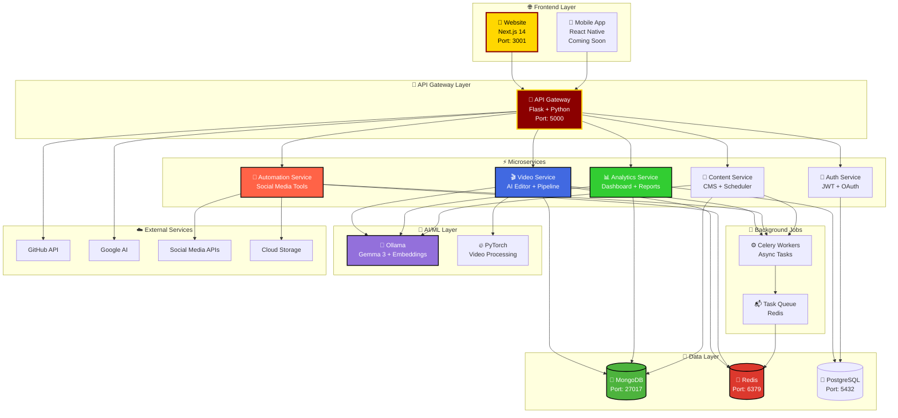

---

## 🔄 2. KULLANICI ANA AKIŞI (USER JOURNEY)

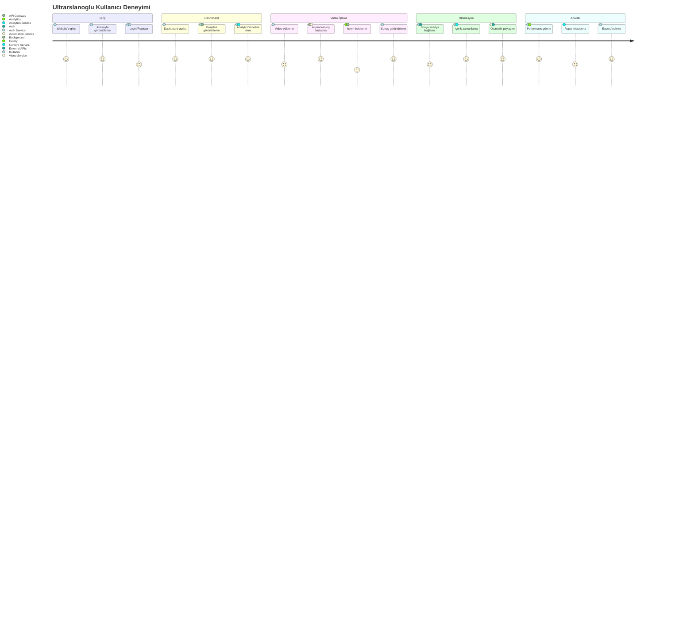

---

## 📹 3. VİDEO İŞLEME AKIŞI

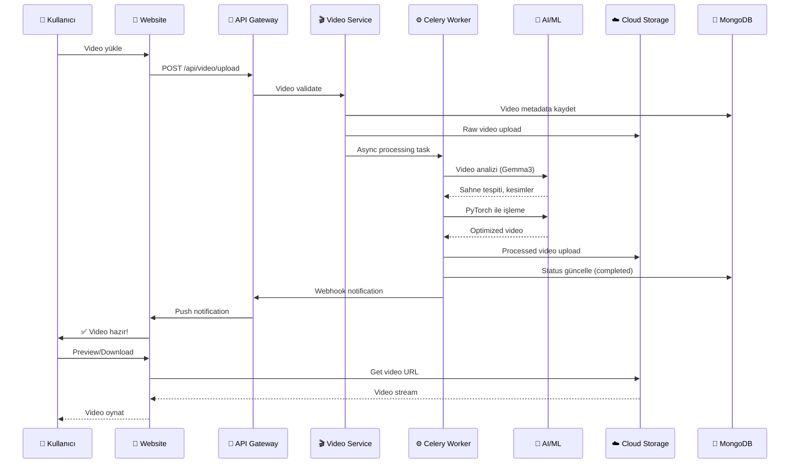

---

## 🤖 4. SOSYAL MEDYA OTOMASYON AKIŞI

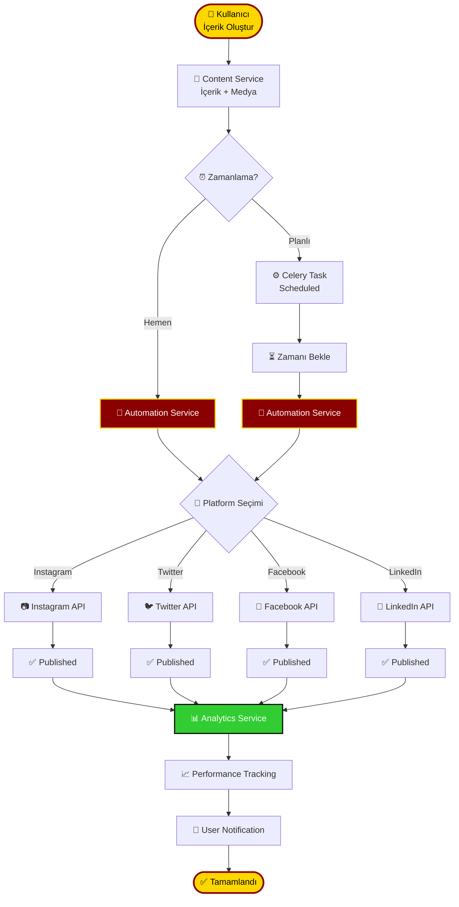

---

## 📊 5. ANALİTİK VE RAPORLAMA AKIŞI

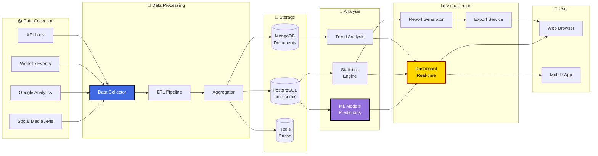

---

## 🔐 6. KİMLİK DOĞRULAMA AKIŞI

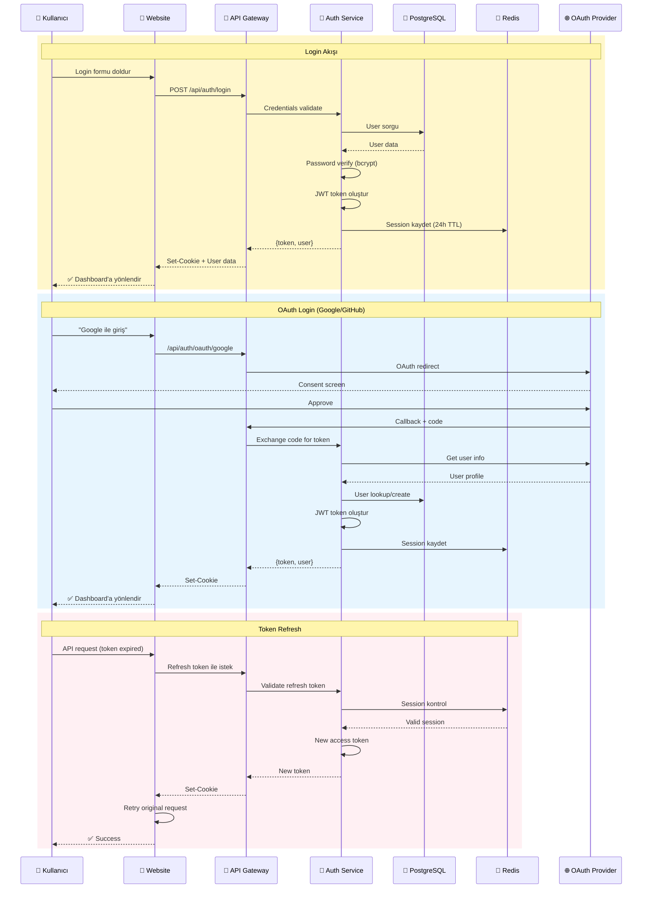

---

## 🏃 7. CELERY BACKGROUND JOB AKIŞI

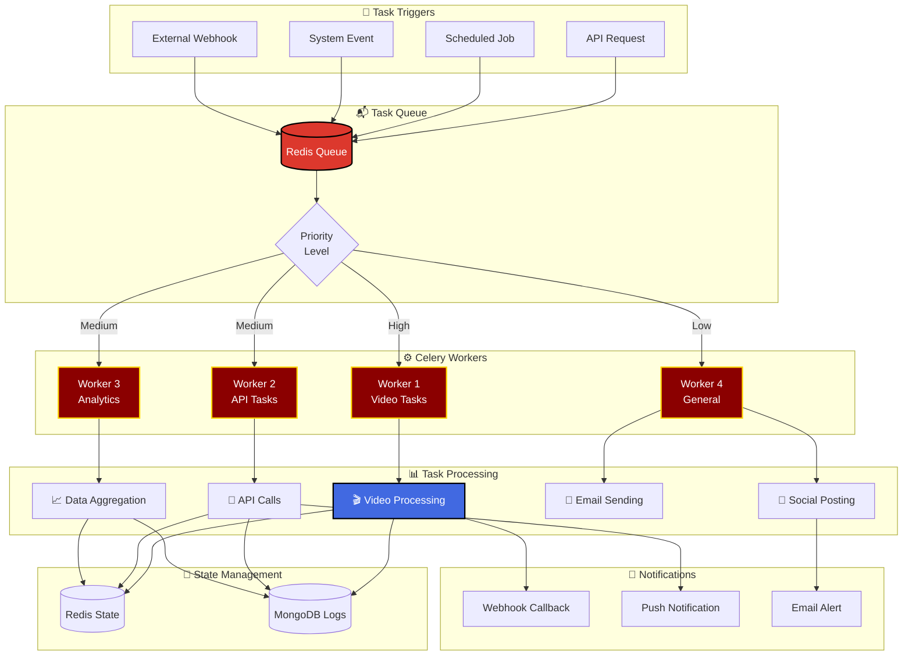

---

## 🌊 8. FULL DATA FLOW (BAŞTAN SONA)

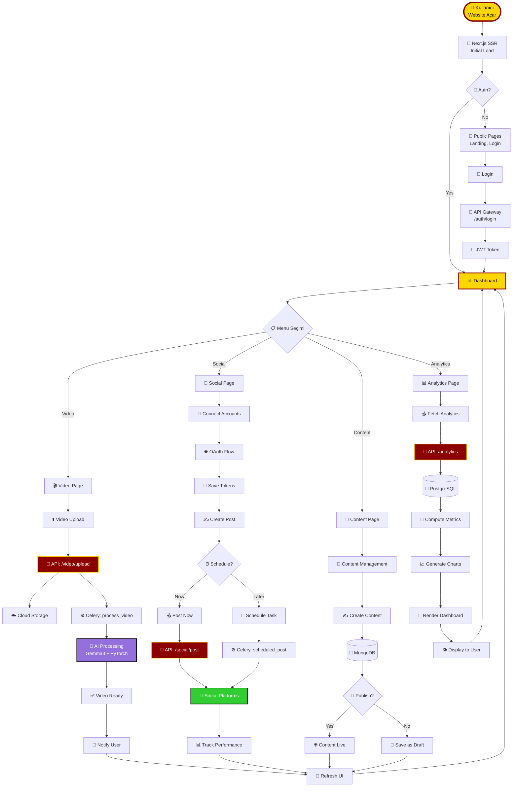

---

## 🚀 9. DEPLOYMENT PIPELINE

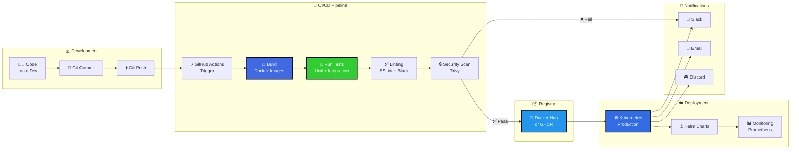

---

## 📱 10. MOBİL APP AKIŞI (Gelecek)

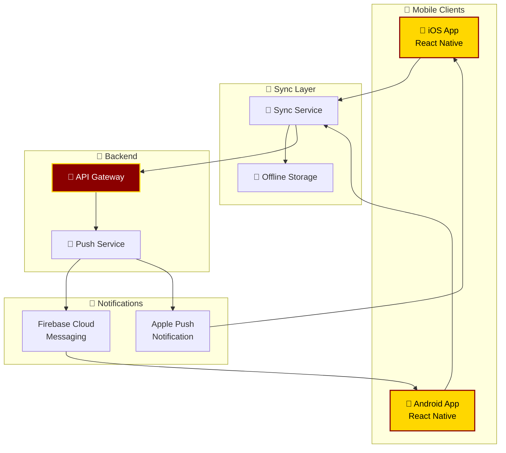

---

## 🎯 ÖZET: ANA AKIŞ ÇİZELGESİ

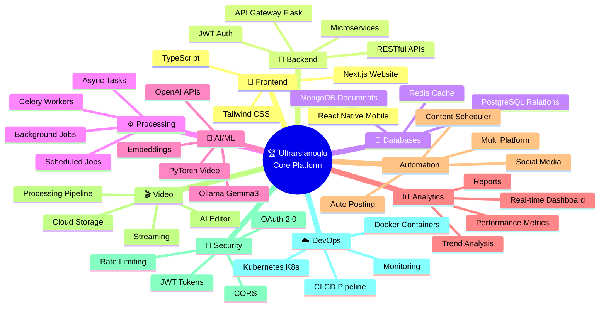

---

## 📈 CURRENT STATUS vs FUTURE

| Bileşen | Status | Tamamlanma |
|---------|--------|------------|
| 🎨 **Website (Frontend)** | ✅ Çalışıyor | 95% |
| 🚀 **API Gateway** | 🟡 Kısmi | 70% |
| 💾 **Databases (All)** | ✅ Çalışıyor | 100% |
| ⚙️ **Celery Workers** | ✅ Çalışıyor | 90% |
| 🎬 **Video Service** | 🔴 Geliştirilecek | 40% |
| 📊 **Analytics Service** | 🔴 Geliştirilecek | 30% |
| 🤖 **Automation Service** | 🔴 Geliştirilecek | 20% |
| 🔐 **Auth Service** | 🟡 Temel var | 60% |
| 📝 **Content Service** | 🔴 Geliştirilecek | 15% |
| 🧠 **AI Integration** | 🟡 Hazır (Ollama) | 50% |
| 📱 **Mobile App** | 🔴 Planlanıyor | 0% |
| ☸️ **Kubernetes** | 🔴 Hazırlanıyor | 10% |

**Genel İlerleme**: 🟡 **~55% Tamamlandı**

---

*Görselleştirme oluşturuldu: 3 Ocak 2026*
